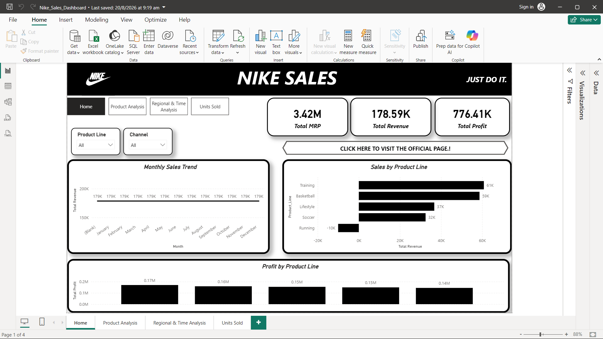
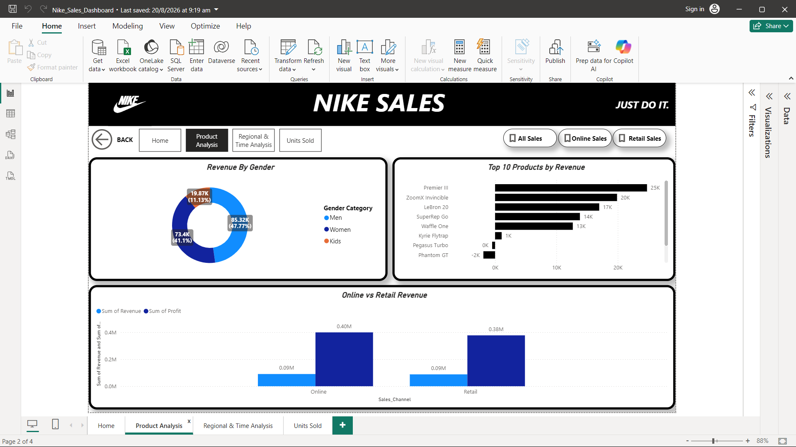
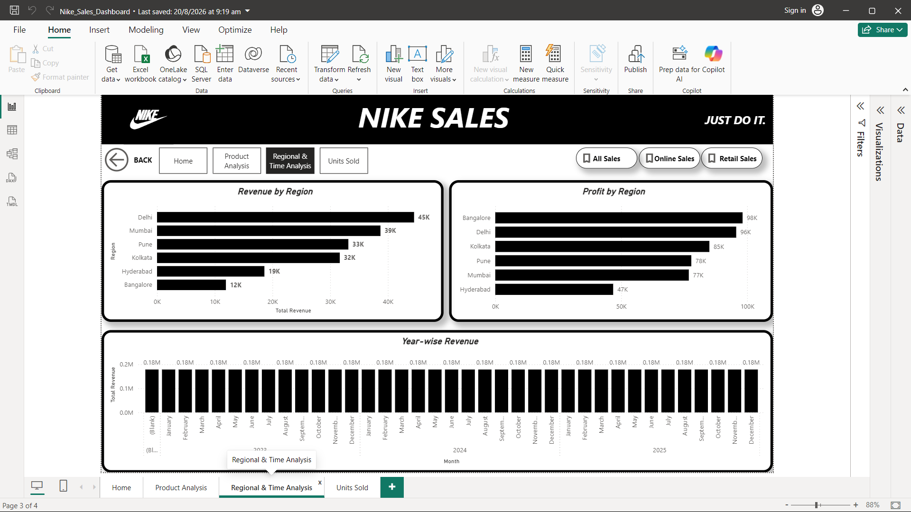

# Nike Sales Analysis – Excel & Power BI

## 📊 Project Overview

This project analyzes Nike sales transaction data using Microsoft Excel and Power BI.

The project was completed in two phases:

1. Data Pre-processing using Microsoft Excel
2. Data Visualization and Analysis using Power BI

The objective was to clean and transform the raw sales dataset, perform preliminary analysis, create a structured Fact and Dimension data model, and develop an interactive Power BI dashboard.

---

## 🎯 Project Objectives

- Clean and preprocess raw Nike sales data
- Handle missing and invalid values
- Standardize inconsistent categorical data
- Perform preliminary analysis using PivotTables
- Create Fact and Dimension tables
- Build a structured data model
- Create DAX measures
- Develop an interactive Power BI dashboard
- Identify useful sales and profitability insights

---

## 🗂️ Dataset

The dataset contains Nike sales transaction information with the following fields:

- Order_ID
- Gender_Category
- Product_Line
- Product_Name
- Size
- Units_Sold
- MRP
- Discount_Applied
- Revenue
- Order_Date
- Sales_Channel
- Region
- Profit

The raw dataset contained missing values, inconsistent categories, and invalid values that required preprocessing.

---

# 🔹 Phase 1 – Data Pre-processing using Excel

The raw dataset was cleaned and transformed using Microsoft Excel.

### Data Cleaning Performed

- Removed duplicate records
- Handled missing values in Units Sold
- Handled missing and invalid MRP values
- Cleaned Discount Applied
- Standardized Size values
- Standardized Region values
- Standardized Order Date
- Validated Revenue
- Used filtering and sorting to inspect problematic records

### Region Standardization

Examples:

| Original Value | Standardized Value |
|---|---|
| bengaluru | Bangalore |
| Bangalore | Bangalore |
| Hyd | Hyderabad |
| hyderbad | Hyderabad |
| Hyderabad | Hyderabad |

### PivotTable Analysis

Created PivotTables for:

- Sales by Product Line
- Sales by Region
- Sales by Gender
- Sales by Year and Month

### Data Model Preparation

Created:

**Fact Table**
- Fact_Sales

**Dimension Tables**
- Dim_Product
- Dim_Date
- Dim_Region
- Dim_SalesChannel
- Dim_Gender

---

# 🔹 Phase 2 – Data Visualization using Power BI

The Fact and Dimension tables were imported into Power BI.

### Power Query

- Imported all Fact and Dimension tables
- Checked and corrected data types
- Prepared data for modeling

### Data Modeling

Created relationships between:

- Fact_Sales and Dim_Product
- Fact_Sales and Dim_Date
- Fact_Sales and Dim_Region
- Fact_Sales and Dim_SalesChannel
- Fact_Sales and Dim_Gender

### DAX Measures

Created measures such as:

- Total Revenue
- Total Profit
- Total Units Sold
- Total Orders
- Profit Margin

### Dashboard Visualizations

The Power BI report includes:

- KPI Cards
- Line Charts
- Bar Charts
- Column Charts
- Donut Charts
- Interactive Slicers

### Interactivity

Implemented:

- Page Navigation
- Buttons
- Bookmarks
- Slicers
- Drill-down analysis

---

# 📸 Dashboard Preview

## Executive Overview



## Product Analysis



## Regional & Time Analysis



---

# 🛠️ Tools Used

| Tool | Purpose |
|---|---|
| Microsoft Excel | Data cleaning and transformation |
| Excel PivotTables | Preliminary data analysis |
| Power Query | Data preparation |
| Power BI | Data modeling and visualization |
| DAX | Calculated measures |
| GitHub | Project documentation and version control |

---

# 📁 Project Structure

```text
Nike-Sales-Analysis/
│
├── Data/
│   └── Nike_Sales_Uncleaned.xlsx
│
├── Excel/
│   └── Nike_Sales_Analysis.xlsx
│
├── PowerBI/
│   └── Nike_Sales_Dashboard.pbix
│
├── Documentation/
│   └── Phase_1_Data_Preprocessing_Report.docx
│
├── Screenshots/
│   ├── 01_Executive_Overview.png
│   ├── 02_Product_Analysis.png
│   └── 03_Regional_Time_Analysis.png
│
└── README.md
